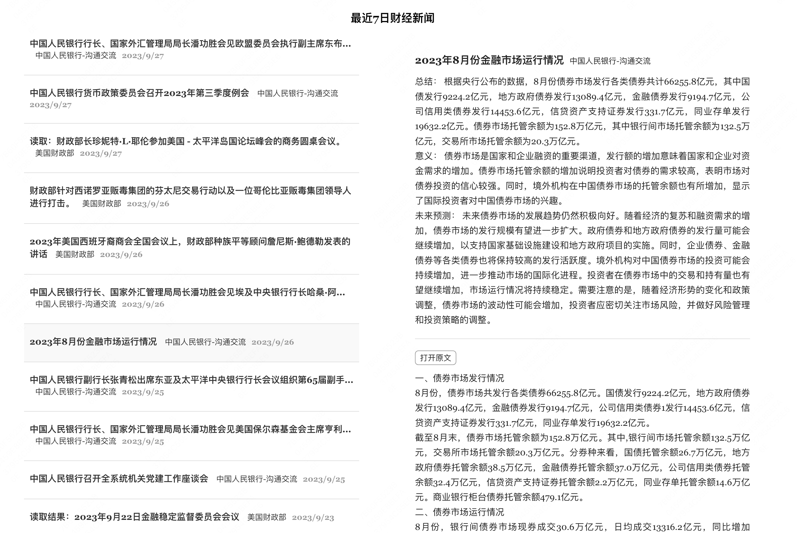

## 有大模型辅助的财经新闻早报



### 项目背景

最近对财经类的内容感兴趣，但因为没有足够多的相关知识，直接去看美联储等机构的新闻或数据觉得生涩难懂，再加上有些官方部门的新闻像是哑谜，让人看着费劲又提不起兴趣。这导致我对财经类的信息摄入只能通过一些博主的分析视频。长期如此，弊端非常明显，第一是博主的输出较不稳定不及时，第二是很多内容在国内媒体上不能讲，第三是长期依赖财经博主，我担心会失去自己的判断力。我个人是想去看信息源头的，但又不想让这件事变得很枯燥。

随着大模型的火爆，最近也看了一些相关的内容，并尝试自己写了一些 prompt。我发现大模型非常擅长总结和改写，其可将非结构化的表达改为结构化，可将枯燥内内容风格化，如果用大模型将财经新闻的源头转换为易于每个人自己理解的新闻版本，并让模型给出数据背后的意义以及其对未来的判断，这样对于我这个外行来看，新闻也就不那么枯燥了。

这就是此项目的由来。

## 使用方法

目前还没有将此项目部署都任何服务器上，仅在本地使用

### 安装依赖
项目中`backend`，`frontend`，`spider`文件夹中的`npm`包需要分别执行`npm install`

### 配置
在项目根目录`config.json`中配置`OPENAI_API_KEY`

### 获取新闻

目前项目中有美联储，美财政部，中国人民银行三家的新闻爬虫，安装依赖后，直接执行如下命令会将新闻内容爬取下来并通过`OPENAI`的`gpt-3.5-turbo-16k`模型分析总结后放入本地的`sqlit`数据库

``` bash
cd spider && npm run start  
```

### 看最近七日新闻

``` bash
cd backend && npm run start
```

执行后打开命令行中的URL即可查看